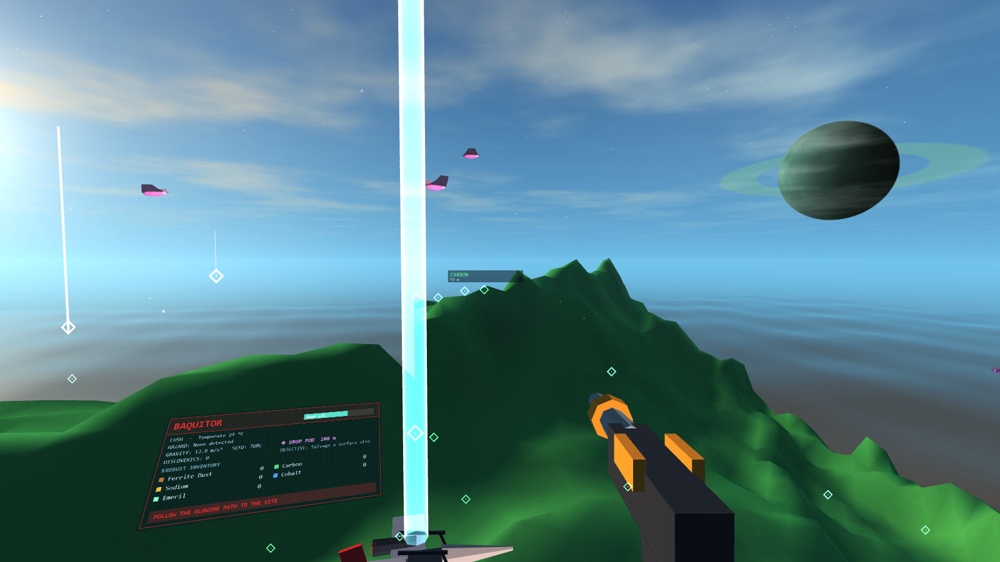
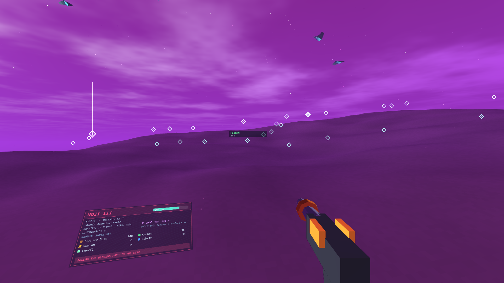
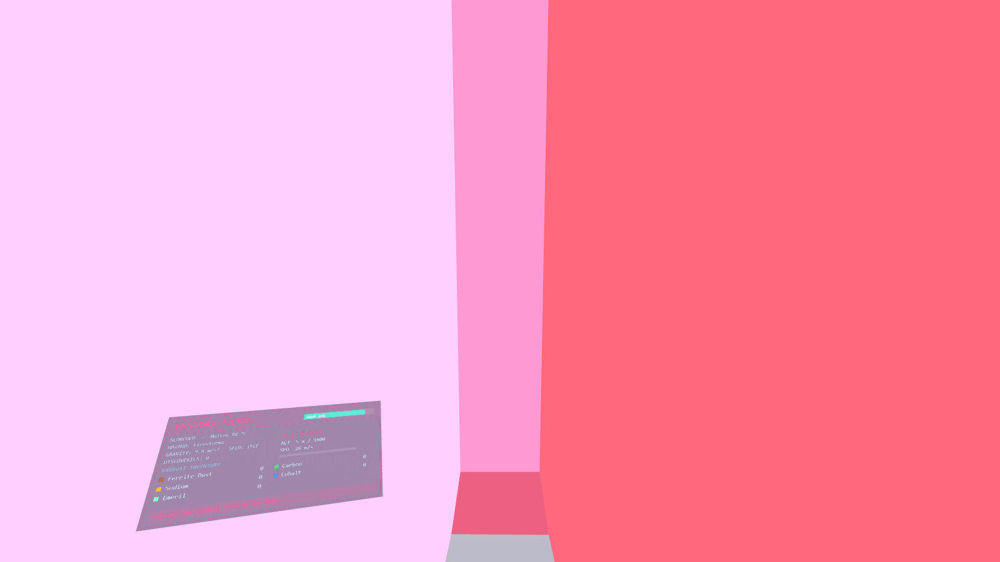
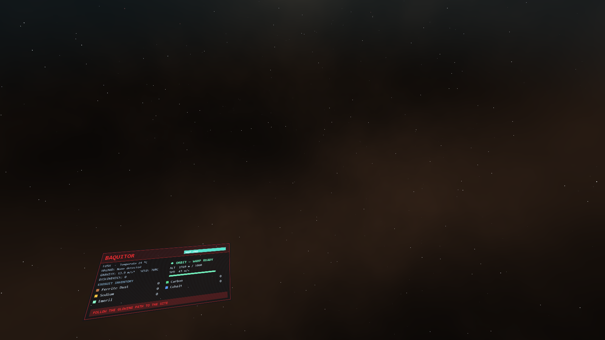
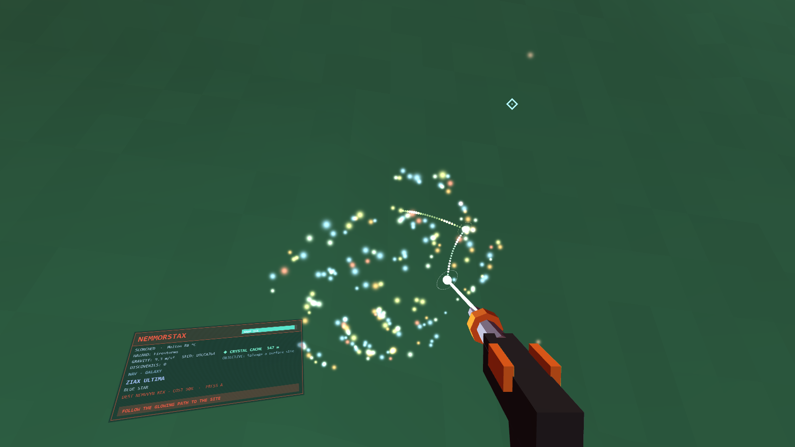
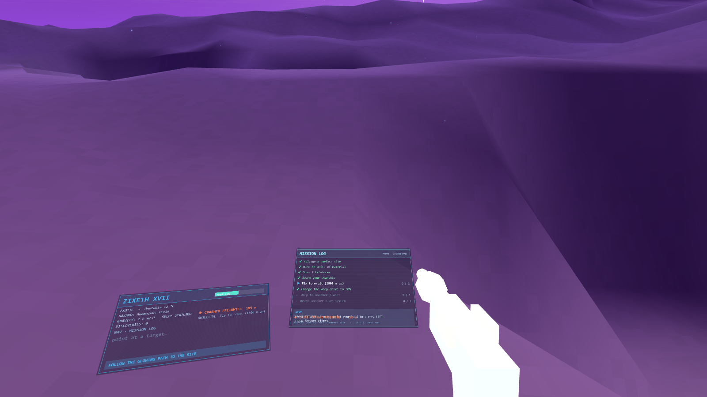
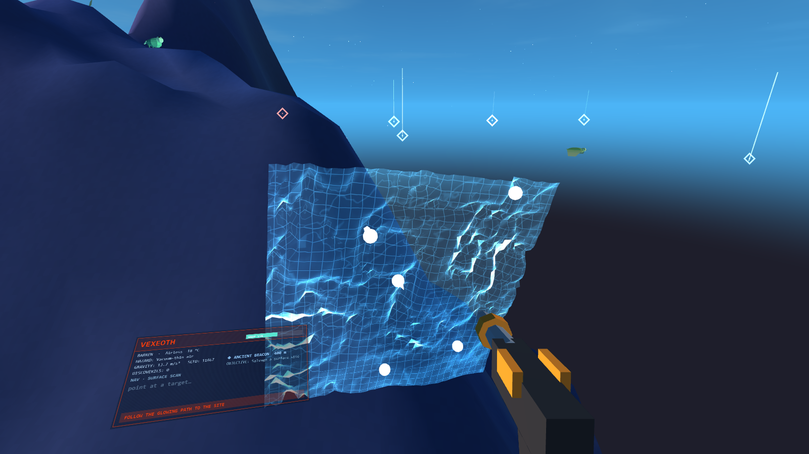
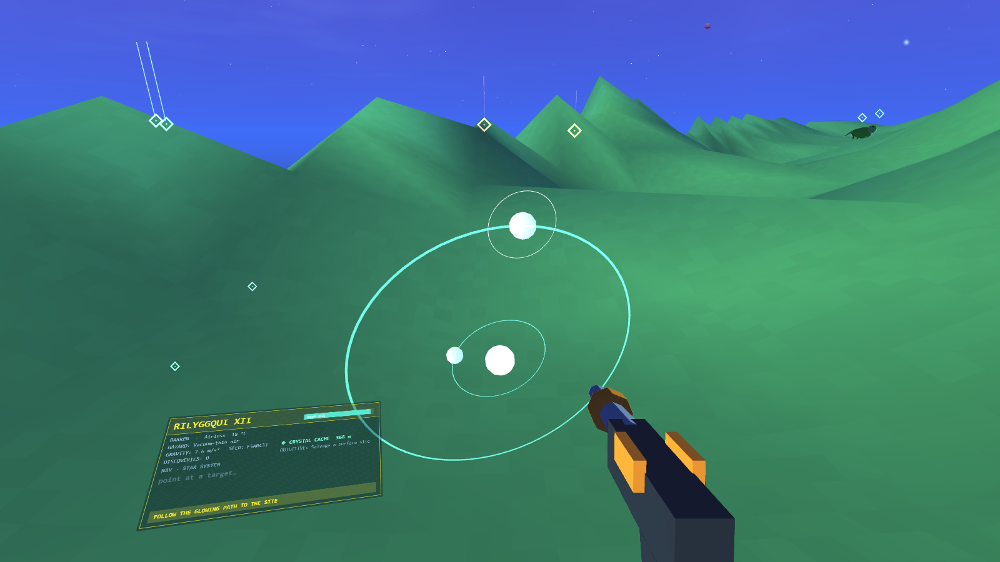

<div align="center">

# ✦ NO MAN'S SKY VR ✦

### An infinite universe in your Quest 3. No install. No store. Just a link.

**[▶  PLAY NOW  ◀](https://no-mans-sky-vr.pages.dev/)**

`no-mans-sky-vr.pages.dev`

*One HTML file · zero libraries · raw WebGL2 + WebXR*



</div>

---

<div align="center">

## Step outside. Everything you see is generated from a number.

</div>

You wake on a world nobody has named. A glowing path runs off toward a wreck on
the horizon. Your ship is parked on the ridge behind you. Above, a ringed
neighbour hangs in a sky that has never existed before and will never exist
again — unless you remember the seed.

<table>
<tr>
<td width="50%">


**Everything is labelled.** Diamond markers float over every plant, crystal and
salvage site, coloured by what they yield. Look at one and it tells you its name
and how far away it is.

</td>
<td width="50%">


**Your ship is real.** Call it from anywhere and it flies down to you. Point
your hand to steer, squeeze to thrust, and go.

</td>
</tr>
<tr>
<td width="50%">


**Climb past the sky.** At 700 m the air thins. At 1800 m the blue is gone, the
stars come out, and the warp drive arms itself.

</td>
<td width="50%">


**190 stars, five spiral arms.** Point at one to plot a route. Dotted light
arcs across the void to your destination.

</td>
</tr>
</table>

---

<div align="center">

## The hologram on your left hand

</div>

<table>
<tr>
<td width="33%"><br><b>MISSION LOG</b><br>Eight objectives, live progress, and a plain-English hint naming the exact button to press next.</td>
<td width="33%"><br><b>SURFACE SCAN</b><br>A real 3-D mesh of the 1.4 km around you. Pick a site, drop a waypoint.</td>
<td width="33%"><br><b>STAR SYSTEM</b><br>Worlds you've landed on light up. The rest stay grey and <i>UNCHARTED</i>.</td>
</tr>
</table>

---

<div align="center">

## What's actually in there

</div>

| | |
|---|---|
| 🪐 **Seven world types** | Lush, Desert, Frozen, Toxic, Scorched, Barren, Exotic — each with its own palette, gravity, hazard and weather |
| 🌍 **Streaming terrain** | Domain-warped continents and ridged mountains, rebuilt as 64 m chunks around you |
| 🌱 **Living surfaces** | Grass, glowing pods, boulders, crystal clusters, three tree styles and rare monoliths, all swaying in the wind |
| 🦅 **Fauna** | Flocks with flapping wings overhead, grazers wandering the ground near you |
| ⛏️ **A reason to dig** | Mining and salvage charge the warp drive. No charge, no travel |
| 🚀 **Atmospheric flight** | Point-to-fly controls that never roll your stomach, with a real transition to vacuum |
| ✨ **Warp you can watch** | The drive spools, the tunnel opens, stars streak past, and you arrive **in orbit** |
| 🔊 **Generated audio** | A wind bed and a drifting chord that retunes for every planet |

---

<div align="center">

## Controls

</div>

**In the headset**

| Do this | Get this |
|---|---|
| Left stick | Walk — *push it all the way to sprint* |
| Right grip | Jetpack |
| Right trigger | Mining beam |
| Left trigger | Scanner pulse |
| **Left Y** | Open the hologram |
| **Left X** | Mission → Surface → System → Galaxy |
| Point + right trigger | Select |
| **Right A** | Engage warp |
| **Right B** | Call / board / leave your ship |
| Right trigger *(flying)* | Thrust — point your hand to steer |

**At a desk** — `WASD`, mouse look, `Space` jetpack, click to mine, `R` scan,
`F` ship, `M` map, `Tab` map mode, `E` warp, `Esc` menu.

---

<div align="center">

## Run it yourself

</div>

```bash
git clone https://github.com/ajinkyagorad/no-mans-sky-vr.git
```

Open `nms-vr.html`. That's the whole game — one file, no build step, no
dependencies, no network calls at runtime.

For VR you need HTTPS, which is what the live link is for. To host your own:

```bash
npx wrangler pages deploy public --project-name my-vr-world
```

<details>
<summary><b>Under the hood</b></summary>

<br>

Everything hangs off one universe seed. That seed fixes the galaxy; each star
seeds its planets; each planet seed fixes its terrain, palette, flora, fauna,
sky and salvage sites. Nothing is stored — the same star always has the same
worlds, forever.

Written against raw WebGL2 with no libraries: hand-rolled matrix maths, a seeded
simplex-noise field, procedurally built meshes, GPU instancing for surface props,
and WebAudio for everything you hear. Tuned for the Quest 3 at 72–90 Hz — around
60 terrain chunks and six instanced draw calls for every plant and rock in view,
fixed foveation, and chunk generation budgeted to one per frame so streaming
never stalls a frame.

| Path | What it is |
|---|---|
| `nms-vr.html` | The game. All of it. |
| `public/index.html` | Deploy copy, written by `deploy.ps1` |
| `tools/capture.ps1` | Renders the screenshots above headlessly |
| `deploy.ps1` · `wrangler.toml` | Cloudflare Pages publishing |

</details>

---

<div align="center">

**[▶  PLAY IT NOW  ◀](https://no-mans-sky-vr.pages.dev/)**

<sub>An unofficial fan tribute, built for fun. Not affiliated with, endorsed by,
or connected to Hello Games or *No Man's Sky*. MIT licensed.</sub>

</div>
